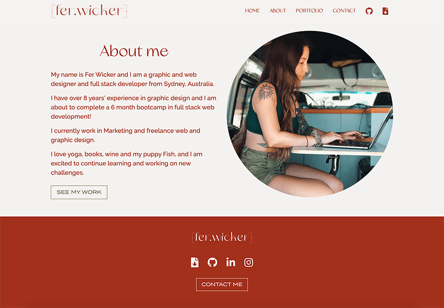

# Fer Wicker Portfolio

This project presents my recent work as a web developer and designer in a cute and clean website that shows some of my style and personality. It was a fun and interesting project, updating the previous version of my portfolio.
[Visit my portfolio.](https://ferwicker.github.io/)

## Table of contents
  - [Motivation](#motivation)
  - [Process](#process)
  - [Built with](#built-with)
  - [Features](#features)
  - [Roadmap](#roadmap)
  - [Credits](#credits)

## Motivation
Having an up to date and good looking portfolio is essential for all creatives and especially web developers. It is a fun project and a chance to feature your skills as a designer and developer in their best light. 

## Process
The process of updating the portfolio started with a review of the content in the previous version. I decided to completely change the look and feel, taking some inspiration from the changing seasons. 

The new look is cleaner with more muted colours and a couple cool fonts.

This version of my portfolio uses React to create reusable components. This is taken advantage on the nav, footer and projects, and allows to make changes only once.

## Built with
- HTML, CSS, Javascript
- [React](https://reactjs.org/)
- [Bootstrap](https://getbootstrap.com/)
- [Adobe XD](https://www.adobe.com/au/products/xd.html) (prototyping)

## Features
- Cool design
- About me section
- Downloadable Resume
- Project pages

## Roadmap
Skills and projects are always evolving. I look forward to adding some subtle animation and micro interactions in the near future.

### [See deployed application](https://ferwicker.github.io/)

## Credits
- All icons from [Fontawesome](https://fontawesome.com/)
- Using fonts from [Adobe Fonts](https://fonts.adobe.com/) and [YouWorkForThem]( http://ywft.us/217161bdc)
- Graphics from [YouWorkForThem](http://ywft.us/2c91a88f0)
